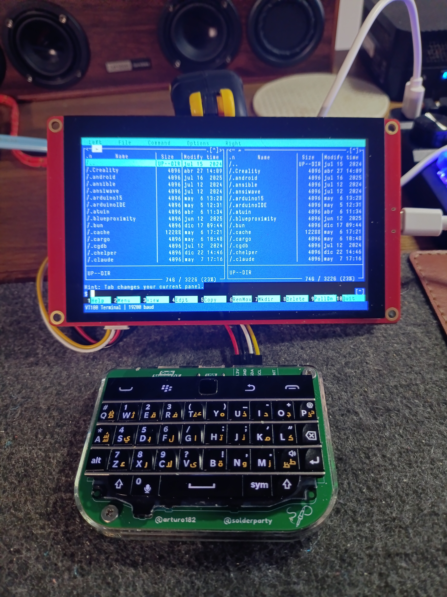

# Terminado - VT100 Terminal Emulator for ESP32-S3

A fully functional VT100/VT102 terminal emulator built on ESP32-S3 hardware, providing a classic terminal experience with modern components.

## Overview



Terminado transforms a CrowPanel ESP32-S3 HMI board with an 800×480 display and BBQ20 keyboard into an authentic VT100 terminal. It connects to any Linux system via USB serial and provides a complete terminal computing experience.

## Hardware Components

- **Display**: CrowPanel ESP32 HMI Display 5.0 inch (800×480 pixels)
- **Microcontroller**: ESP32-S3
- **Keyboard**: BBQ20 mechanical keyboard (RP2040-based)
- **Connection**: USB serial to host computer
- **Internal**: I2C between ESP32-S3 and BBQ20 keyboard (SDA=IO19, SCL=IO20)

## Features

### Terminal Emulation
- **VT100/VT102 Compatibility**: Full escape sequence support including DECAWM, DECOM, DECCKM, DECTCEM, DECSCNM, IRM, LNM
- **ANSI Colors**: 8 standard colors + bright variants with per-cell attribute tracking
- **Text Attributes**: Bold, italic, reverse video, underline, blink
- **Cursor**: Blinking cursor, visibility control (DECTCEM), save/restore
- **Tab Stops**: Full tab stop system (HTS/TBC), initialised at every 8 columns
- **Scroll Regions**: Correct DECSTBM scroll region support
- **Character Sets**: VT100 line-drawing characters (ACS), alternate charset handling
- **CSI Sequences**: A/B/C/D/E/F/G/H/I/J/K/L/M/P/S/T/Z/@/d and more
- **Device Attributes**: Primary and secondary DA responses, DECREQTPARM
- **Reset**: Full device reset via ESC c

### Display
- **Font**: Iosevka Nerd Font Mono (Regular, Bold, Italic, Bold-Italic)
- **Font Sizes**: 4pt, 6pt, 7pt, 10pt — selectable at runtime
- **Columns/Rows**: Auto-calculated from font metrics; up to ~133×47 at 4pt, ~55×19 at 10pt
- **Rendering**: Incremental updates — only changed cells are redrawn

### Configuration Menu
Press **Fn + ESC** to open the overlay settings menu. Navigate with **W/S**, change values with **A/D**, press **ESC** to apply and close.

| Setting   | Options |
|-----------|--------|
| Font Size | 4pt, 6pt, 7pt, 10pt |
| Baud Rate | 300 … 230400 |
| Data Bits | 5, 6, 7, 8 |
| Stop Bits | 1, 2 |
| Parity    | None, Even, Odd |
| XON/XOFF  | On, Off |

All settings are **persisted to ESP32 NVS** (flash) and restored automatically on boot.

### Host Communication
- **Serial Protocol**: Configurable baud/bits/parity (default 19200 8N1)
- **Device Identification**: Responds to VT100 device attribute queries
- **Size Reporting**: Reports terminal dimensions to host on geometry change
- **Bidirectional**: Keyboard input to host, display output from host

### Keyboard
- **BBQ20 keyboard** via I2C
- **Fn key** (ASCII 7) for special functions
- **Ctrl key** (ASCII 18) for control sequences
- **Arrow keys**: Fn+W/A/S/D, with application cursor key mode (DECCKM) support
- **Auto-repeat** for held keys

### Integration
- **Auto-login**: Passwordless login via systemd getty
- **Shell Compatible**: Works with bash, fish, zsh, and other shells
- **Application Support**: nano, vim, htop, tmux, screen, vttest, etc.

## Technical Implementation

### Architecture
```
Host Computer ← USB Serial → ESP32-S3 ← I2C → BBQ20 Keyboard
                                        ↓
                                  800×480 Display
```

### Software Components

**VT100 Core** (`vt100.h`, `vt100.cpp`)
- State machine for escape sequence parsing (ground, escape, CSI, OSC, charset states)
- Screen buffer: up to 133×47 cells of char + attribute per cell
- Cursor, scroll region, origin mode, tab stops
- UTF-8 pass-through for box-drawing characters

**Display Layer** (`terminado.ino`)
- LovyanGFX rendering engine
- Efficient incremental updates (only changed cells)
- Runtime font metric probing to auto-size the grid
- Color mapping and attribute rendering
- Blinking cursor with DECTCEM support

**Config Menu** (`config_menu.h`)
- Overlay dialog drawn directly on TFT
- Reads/writes `TermConfig` struct via Arduino `Preferences` (ESP32 NVS)
- Applies `Serial.begin()` with new parameters on close
- Reconfigures terminal grid geometry when font changes

**Font Headers** (`iosevka_*.h`)
- Generated by `import_fonts.sh` using `fontconvert`
- 16 files: 4 variants × 4 sizes (4/6/7/10pt)
- Stored in PROGMEM on the ESP32

## Installation

### Arduino Setup

1. Install Arduino ESP32-S3 support
2. Install required libraries:
   - LovyanGFX
   - BBQ10Keyboard
3. Upload `terminado.ino` to ESP32-S3

### Regenerating Fonts

Requires `fontconvert` from the Adafruit GFX library tools and the Iosevka Nerd Font Mono TTF files in `/usr/share/fonts/TTF/`.

```bash
bash import_fonts.sh
```

### Host Configuration

Install the systemd service for automatic login:

```bash
sudo mkdir -p /etc/systemd/system/getty@ttyUSB0.service.d
sudo cp getty-terminado.service /etc/systemd/system/getty@ttyUSB0.service.d/override.conf
sudo systemctl daemon-reload
sudo systemctl enable --now getty@ttyUSB0.service
```

**Note**: Edit `getty-terminado.service` to set your username.

## Usage

1. **Connect** ESP32-S3 to your Linux computer via USB
2. **Power on** the ESP32-S3
3. **Automatic login** — getty starts and logs you in
4. **Use terminal** — keyboard input goes to host, display shows output
5. **Config menu** — press Fn+ESC to change font size, baud rate, etc.

### Key Bindings

| Key | Action |
|-----|--------|
| Fn + ESC | Open/close config menu |
| Fn + W/A/S/D | Arrow keys (Up/Left/Down/Right) |
| Ctrl + key | Send control character |

## Troubleshooting

### No Login After ESP32 Reset

```bash
sudo systemctl reset-failed getty@ttyUSB0.service
sudo systemctl restart getty@ttyUSB0.service
```

### stty shows wrong terminal size after font change

The host is notified of the new size via `CSI 8;rows;cols t` but a raw getty session may not propagate `SIGWINCH` to running processes. Start a new shell session after changing font size for the correct dimensions to take effect.

### Check Service Status
```bash
sudo systemctl status getty@ttyUSB0.service
```

## Tested Applications

- **Editors**: nano, vim
- **Monitors**: htop, btop
- **Shells**: fish, bash, zsh
- **Tools**: ls --color, grep --color, git diff
- **Multiplexers**: tmux, screen
- **Test suite**: vttest

## License

This project builds upon:
- **LovyanGFX**: See library license
- **BBQ10Keyboard**: See library license
- **Spleen font**: BSD 2-Clause License (see `LICENSE.spleen`)
- **Font5x7FixedMono**: See font source for license information
